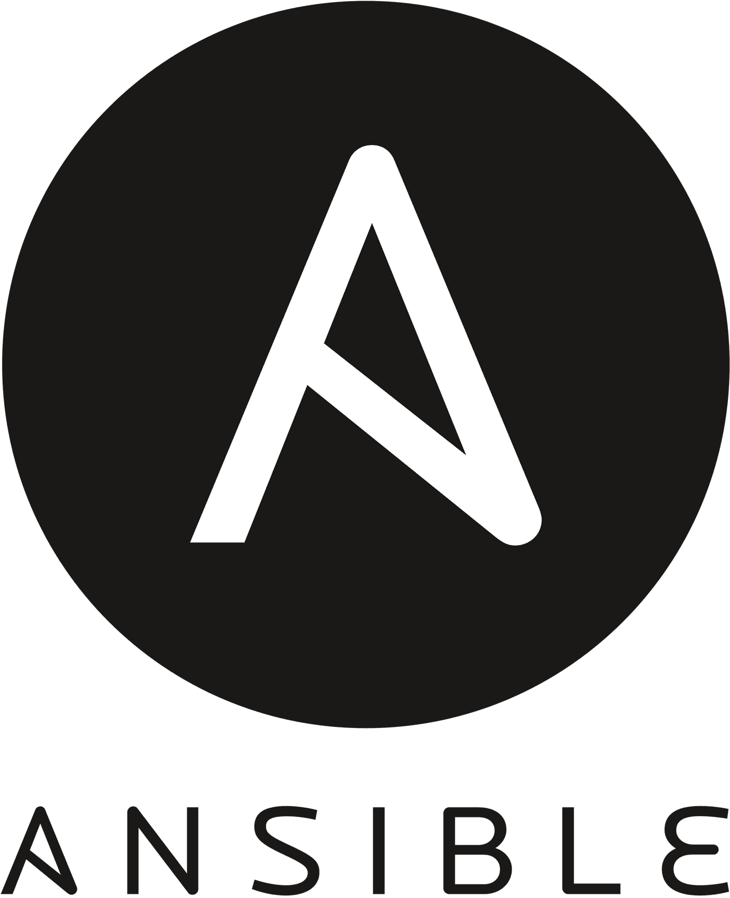
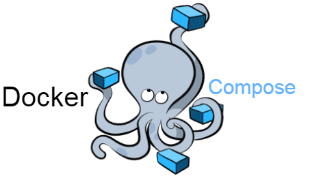

# Automated Deployment of a website infrastructure

  
  
   
  
  
   
  

## Project Overview

This project focuses on the automated deployment of a web server and the necessary Docker infrastructure on a remote server. The goal is to deploy a site, such as a WordPress blog, with each process running in its container. Automation is a key component of this project, and tools like Terraform, Ansible and Docker Compose are used for this process.

## Features

- Automated deployment of a WordPress site.
- Containers for each process (WordPress, PHPmyadmin, MariaDB, etc.).
- Persistence of data across server reboots.
- Secure and limited public access.
- TLS support for secure connections.
- Deployment on multiple servers in parallel.

## Platform Choice

This project uses AWS EC2 instances to host the necessary infrastructure.

## License

This project is licensed under the GNU License. See the [LICENSE](LICENSE) file for details.

